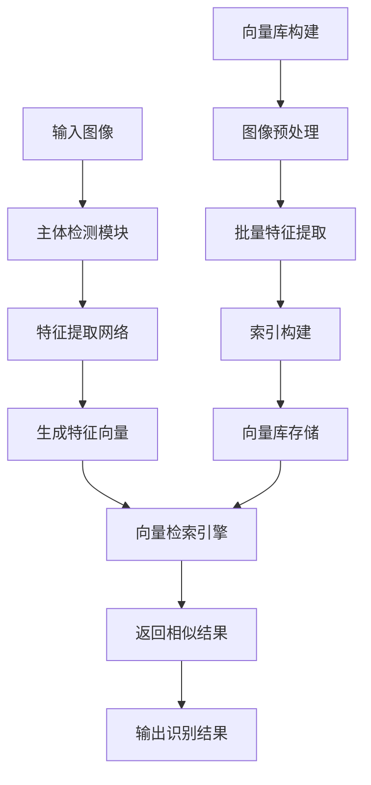
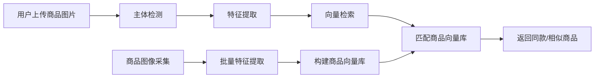
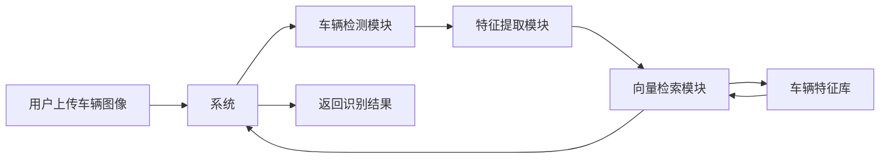

在当今海量图像数据的时代，如何快速准确地从数百万甚至数千万张图像中找到最相似的结果，是图像识别系统面临的核心挑战。传统的一对一分类方法在面对大规模类别识别时显得力不从心，而基于向量检索的技术方案正在成为解决这一问题的关键利器。向量检索（Vector Search）是一种基于特征向量相似度计算的检索技术。在图像识别系统中，每张图像通过深度学习模型被转换为一个高维特征向量，这些向量在向量空间中保持着图像的语义信息。向量检索的核心任务就是：给定一个查询向量，在庞大的向量库中快速找到最相似的K个向量。



其中，我要求的向量检索要支持多种检索算法，包括：

- HNSW32：基于图的近似最近邻搜索算法
- IVF：倒排索引检索方法
- FLAT：暴力检索算法

向量库的管理需要提供完整的向量库生命周期管理功能：

- 新建索引库
- 动态添加向量
- 删除指定向量
- 索引持久化存储

出于系统适配性考虑，向量管理库需要使用Facebook的Faiss库

距离度量方式需要实现1.内积（IP - Inner Product）适用于特征向量已经归一化的情况，值越大表示越相似。2.L2距离（欧式距离）值越小表示越相似，需要转换为相似度分数。

#### 距离度量选择指南

| 场景         | 推荐度量   | 原因                     |
| :----------- | :--------- | :----------------------- |
| 归一化特征   | IP         | 计算高效，直接反映相似度 |
| 非归一化特征 | L2         | 对向量幅度不敏感         |
| 二值特征     | 汉明距离   | 专门为二值设计           |
| 高维稀疏特征 | 余弦相似度 | 对稀疏数据友好           |

比如我有以下三个示例：

示例一：商品识别系统



他的配置文件为：

```yaml
IndexProcess:
  index_method: "HNSW32"
  index_dir: "./product_gallery/index"
  image_root: "./product_images/"
  data_file: "./product_data.txt"
  dist_type: "IP"
  embedding_size: 512
  return_k: 5
  score_thres: 0.7

```

示例二：车辆重识别系统



示例三：logo商标识别

如果是logo，需要特殊处理需求：

- 支持多尺度logo检测
- 处理透明背景logo
- 应对变形和遮挡情况

对于性能优化

1. 索引构建优化

   ```python
   # 批量处理优化
   def build_index_optimized(images, batch_size=32):
       features = []
       for i in range(0, len(images), batch_size):
           batch = images[i:i+batch_size]
           batch_features = extract_features(batch)
           features.extend(batch_features)
       return np.array(features)
   ```

2. 检索参数调优

   | 参数           | 含义         | 调优建议               |
   | :------------- | :----------- | :--------------------- |
   | return_k       | 返回结果数量 | 根据业务需求，通常5-10 |
   | score_thres    | 相似度阈值   | 通过验证集调整         |
   | search_budget  | 搜索预算     | 平衡精度和速度         |
   | hamming_radius | 汉明距离半径 | 二值特征专用           |

3. 内存与速度平衡

   ```mermaid
   pie title 检索算法选择权衡
       "精度优先" : 35
       "速度优先" : 25
       "内存优化" : 20
       "扩展性" : 20
   ```

   

常见问题与解决方案
1. 检索精度不足
    问题现象：返回结果与查询图像不相关 解决方案：

  检查特征提取模型是否合适
  调整相似度阈值score_thres
  考虑使用更精确的算法（FLAT）

2. 检索速度慢
    问题现象：响应时间过长 解决方案：

  使用HNSW32或IVF算法
  调整search_budget参数
  优化向量维度

3. 内存占用过高
    问题现象：系统内存不足 解决方案：

  使用IVF算法减少内存占用
  考虑向量量化技术
  分布式部署检索服务

目前我使用的是YOLO进行主体检测，YOLO的ultralytics我已经给你了，我需要你能修改代码，使用YOLO也能生成特征向量，然后根据我上面的描述构建一个向量库，根据这个YOLO识别生成的特征向量在向量库里实现检索功能。
